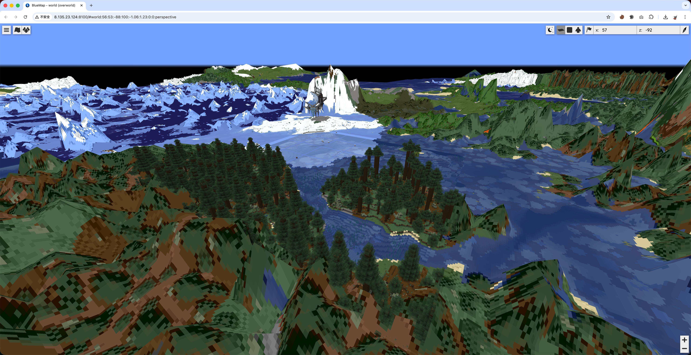
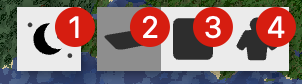

# 网页地图使用指导

## 什么是网页地图

网页地图是我们为了方便服务器外玩家查看服务器实时状态和样貌所添加的功能。该功能由 [BlueMap](https://bluemap.bluecolored.de/) 插件提供（让我们感谢作者做出了这么个强大的插件！）。

服务器运行时，网页地图随即开启。若服务器离线，网页地图无法进入。

## 如何进入

有两种方式进入网页地图。

**方法一：** 登录[控制台](https://st.subilan.win)，如果服务器正在运行状态，你可以在「服务器控制」面板中找到「世界地图」按钮，点击即可跳转到网页地图。

**方法二：** 通过控制台主页或者状态页面获取到服务器最新的 IP 地址后，将其输入到地址栏中，并在末尾加上 `:8100` 端口号回车访问即可。换句话说，网页地图的地址是 `http://X.X.X.X:8100`，其中 `X.X.X.X` 是当前服务器 IP 地址。

## 如何使用

- 放大/缩小：鼠标滚轮
- 移动方位：左键拖动
- 移动视角：右键拖动
- W/A/S/D/↑/↓/←/→：前后左右移动

## 切换视图

网页地图提供了三种视图，我们将其称为立体视图、平面视图和第一人称视图。你可以在网页地图的右上角切换这三种视图。

图中：
- ① 切换昼夜
- ② 立体视图
- ③ 平面视图
- ④ 第一人称视图

在立体视图中，整个世界呈现为三维形式，你可以拖动鼠标四处移动和变换视角。需要注意在立体视图中，你的位置总是处于你的视角所在的位置的最上面一个方块上。

在平面视图中，整个世界呈现为二维形式，类似于游戏内的小地图。

第一人称视图类似于游戏中的旁观者模式，你可以自由地控制自己所处的位置，并使用空格抬升高度、Shift 降低高度。
